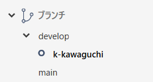

# NIGHTRAVEL 説明書
## このアプリについて
* 。
  * サーバーサイドをMajicOnionで開発し、クライアントサイドをUnityで制作いたしました。
  * クラウドサービスはMicrosoft Azureを使用しており、双方向で通信を行うリアルタイムゲームとなっております。

* ### 作業する際の諸注意
　
  * 作業する際は必ず【ブランチ → main から develop を作成】
  * 【ブランチ → develop から a-tarou(名字頭文字-名前) を作成】
  * 必ず個人のブランチで作業すること(コンフリクト防止の為)
  * マージする際は必ずメンバー全員で確認してから実行(独断で実行しないこと)
